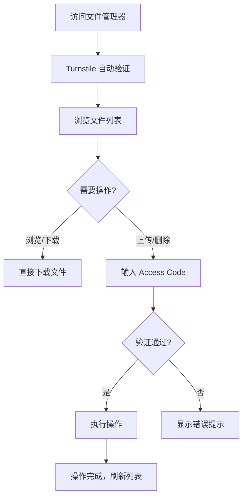

## 1. 产品概述

基于 Cloudflare Workers 的 R2 对象存储文件管理界面，提供直观的 Web 文件浏览器，支持文件上传、下载、删除、预览等操作，并通过 Cloudflare Turnstile 实现人机验证，确保操作安全。

- 目标用户：开发者、运维人员、需要管理 R2 存储桶中文件的团队
- 解决的核心问题：无需第三方 S3 客户端，通过浏览器即可便捷管理 R2 文件

## 2. 核心功能

### 2.1 用户角色

| 角色 | 验证方式 | 核心权限 |
|------|----------|----------|
| 访客 | Turnstile 人机验证 | 浏览文件列表、下载文件 |
| 管理员 | Access Code + Turnstile | 上传、删除、创建文件夹 |

### 2.2 功能模块

1. **文件浏览器页面**：文件列表展示、面包屑导航、文件图标、文件大小/修改时间
2. **文件上传**：拖拽上传、点击上传、多文件支持、上传进度显示
3. **文件操作**：下载、删除（带确认）、预览（图片/文本）
4. **人机验证**：Turnstile 验证组件，执行敏感操作前触发验证
5. **身份认证**：Access Code 输入，管理员权限验证

### 2.3 页面详情

| 页面名称 | 模块名称 | 功能描述 |
|----------|----------|----------|
| 文件管理器 | 顶部导航栏 | 显示应用标题、当前路径面包屑、Access Code 登录/登出 |
| 文件管理器 | 工具栏 | 新建文件夹按钮、上传文件按钮、刷新按钮 |
| 文件管理器 | 文件列表 | 表格展示文件/文件夹，含图标、名称、大小、修改时间、操作按钮 |
| 文件管理器 | 上传区域 | 拖拽上传区域，点击选择文件，显示上传进度 |
| 文件管理器 | Turnstile 验证 | 弹窗式 Turnstile 组件，上传/删除操作前需验证通过 |
| 文件管理器 | 文件预览 | 图片预览弹窗、文本文件内容预览 |
| 文件管理器 | 空状态 | 文件夹为空时的引导提示 |

## 3. 核心流程

## 4. 用户界面设计

### 4.1 设计风格

- **主题**：暗色科技风，深色背景搭配霓虹色点缀，体现云存储的技术感
- **主色调**：深灰/黑背景 (#0a0a0f)，橙色主色 (#f48220，Cloudflare 品牌色)，青色辅助色 (#00b4d8)
- **按钮样式**：圆角边框按钮，悬停时发光效果
- **字体**：JetBrains Mono（等宽字体，科技感），系统字体回退
- **布局风格**：左侧边栏 + 右侧内容区，卡片式文件列表
- **图标**：lucide-react 图标库

### 4.2 页面设计概览

| 页面名称 | 模块名称 | UI 元素 |
|----------|----------|---------|
| 文件管理器 | 顶部导航 | 深色背景，橙色品牌标识，面包屑路径，Access Code 状态指示器 |
| 文件管理器 | 工具栏 | 图标按钮组，圆角边框，hover 发光效果 |
| 文件管理器 | 文件列表 | 表格布局，文件类型彩色图标，文件大小格式化，悬停行高亮 |
| 文件管理器 | 上传区域 | 虚线边框拖拽区，中央上传图标，拖入时边框高亮动画 |
| 文件管理器 | Turnstile 弹窗 | 居中模态框，半透明遮罩，Turnstile iframe 嵌入 |
| 文件管理器 | 预览弹窗 | 图片自适应展示，文本文件代码高亮，关闭按钮 |

### 4.3 响应式设计

- 桌面端优先（1024px+），完整表格布局
- 平板端（768px-1024px），工具栏折叠
- 移动端（<768px），卡片式文件列表，底部操作栏

## 5. 技术约束

- 前端：React 18 + TypeScript + Vite + Tailwind CSS
- 后端：Cloudflare Workers（TypeScript）
- 存储：Cloudflare R2
- 验证：Cloudflare Turnstile
- 部署：Wrangler CLI 部署至 Cloudflare Workers