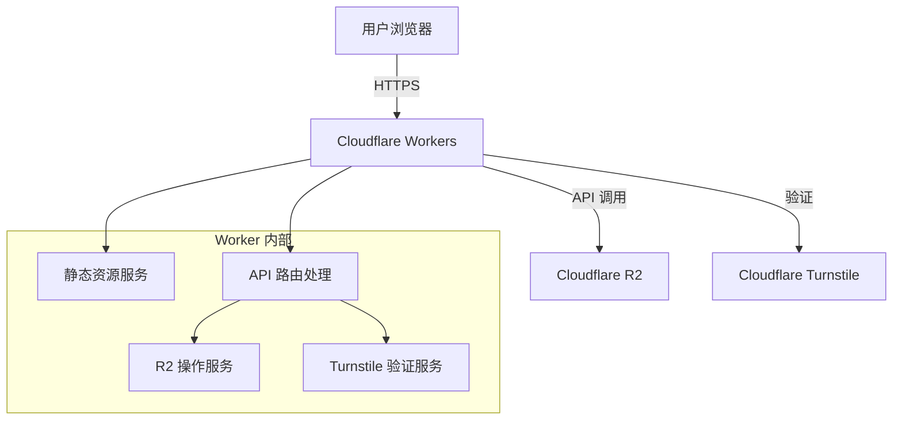
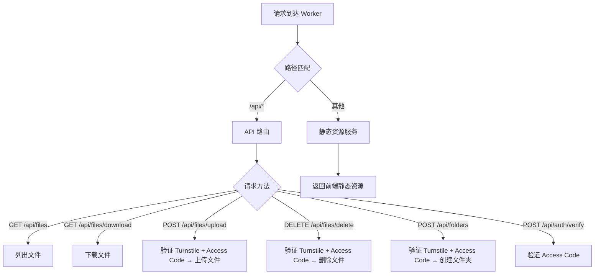

## 1. 架构设计



## 2. 技术选型

- **前端**：React 18 + TypeScript + Vite + Tailwind CSS 3 + Zustand
- **后端**：Cloudflare Workers（TypeScript）
- **存储**：Cloudflare R2 Bucket
- **人机验证**：Cloudflare Turnstile
- **部署**：Wrangler CLI
- **图标**：lucide-react

## 3. 项目结构

```
R2/
├── worker/                    # Cloudflare Worker 代码
│   ├── src/
│   │   ├── index.ts          # Worker 入口，路由分发
│   │   ├── routes/
│   │   │   ├── api.ts        # API 路由处理
│   │   │   └── static.ts     # 静态资源服务
│   │   ├── services/
│   │   │   ├── r2.ts         # R2 操作封装
│   │   │   └── turnstile.ts  # Turnstile 验证
│   │   └── types.ts          # 类型定义
│   ├── wrangler.toml         # Wrangler 配置
│   ├── package.json
│   └── tsconfig.json
├── frontend/                  # React 前端代码
│   ├── src/
│   │   ├── App.tsx
│   │   ├── main.tsx
│   │   ├── index.css
│   │   ├── components/
│   │   │   ├── FileList.tsx      # 文件列表
│   │   │   ├── Toolbar.tsx       # 工具栏
│   │   │   ├── UploadZone.tsx    # 上传区域
│   │   │   ├── Breadcrumb.tsx    # 面包屑导航
│   │   │   ├── TurnstileModal.tsx # Turnstile 验证弹窗
│   │   │   ├── PreviewModal.tsx  # 文件预览弹窗
│   │   │   ├── AccessCodeModal.tsx # Access Code 输入
│   │   │   └── EmptyState.tsx    # 空状态
│   │   ├── hooks/
│   │   │   ├── useFiles.ts       # 文件列表 hook
│   │   │   └── useTurnstile.ts   # Turnstile hook
│   │   ├── store/
│   │   │   └── appStore.ts       # Zustand 全局状态
│   │   ├── utils/
│   │   │   ├── format.ts         # 格式化工具
│   │   │   └── api.ts            # API 请求封装
│   │   └── types/
│   │       └── index.ts          # 前端类型定义
│   ├── index.html
│   ├── package.json
│   ├── tsconfig.json
│   ├── vite.config.ts
│   └── tailwind.config.js
└── .trae/documents/
    ├── PRD.md
    └── TECHNICAL_ARCHITECTURE.md
```

## 4. API 定义

### 4.1 接口列表

| 方法 | 路径 | 功能 | 需要 Turnstile | 需要 Access Code |
|------|------|------|----------------|-----------------|
| GET | /api/files?prefix= | 列出文件 | 否 | 否 |
| GET | /api/files/download?key= | 下载文件 | 否 | 否 |
| POST | /api/files/upload | 上传文件 | 是 | 是 |
| DELETE | /api/files/delete?key= | 删除文件 | 是 | 是 |
| POST | /api/folders | 创建文件夹 | 是 | 是 |
| POST | /api/auth/verify | 验证 Access Code | 否 | 否 |
| POST | /api/turnstile/verify | 验证 Turnstile Token | 否 | 否 |

### 4.2 数据类型

```typescript
// 文件对象
interface R2Object {
  key: string;
  size: number;
  lastModified: string;
  isFolder: boolean;
  etag?: string;
}

// API 响应
interface ApiResponse<T> {
  success: boolean;
  data?: T;
  error?: string;
}

// 文件列表响应
interface ListFilesResponse {
  files: R2Object[];
  prefix: string;
  truncated: boolean;
}

// 上传请求
interface UploadRequest {
  files: File[];
  prefix: string;
  turnstileToken: string;
  accessCode: string;
}

// Turnstile 验证请求
interface TurnstileVerifyRequest {
  token: string;
}

// Access Code 验证请求
interface AccessCodeVerifyRequest {
  code: string;
}
```

## 5. Worker 路由分发逻辑



## 6. 配置说明

### wrangler.toml 配置项

```toml
name = "r2-file-manager"
main = "src/index.ts"
compatibility_date = "2024-01-01"

[[r2_buckets]]
binding = "R2_BUCKET"
bucket_name = "your-bucket-name"

[vars]
ACCESS_CODE = ""  # 管理员访问码，部署时设置
TURNSTILE_SECRET_KEY = ""  # Turnstile 密钥

[site]
bucket = "../frontend/dist"
```

### 环境变量

| 变量名 | 说明 | 必填 |
|--------|------|------|
| ACCESS_CODE | 管理员访问码 | 是 |
| TURNSTILE_SECRET_KEY | Turnstile Secret Key | 是 |
| TURNSTILE_SITE_KEY | Turnstile Site Key（前端使用） | 是 |